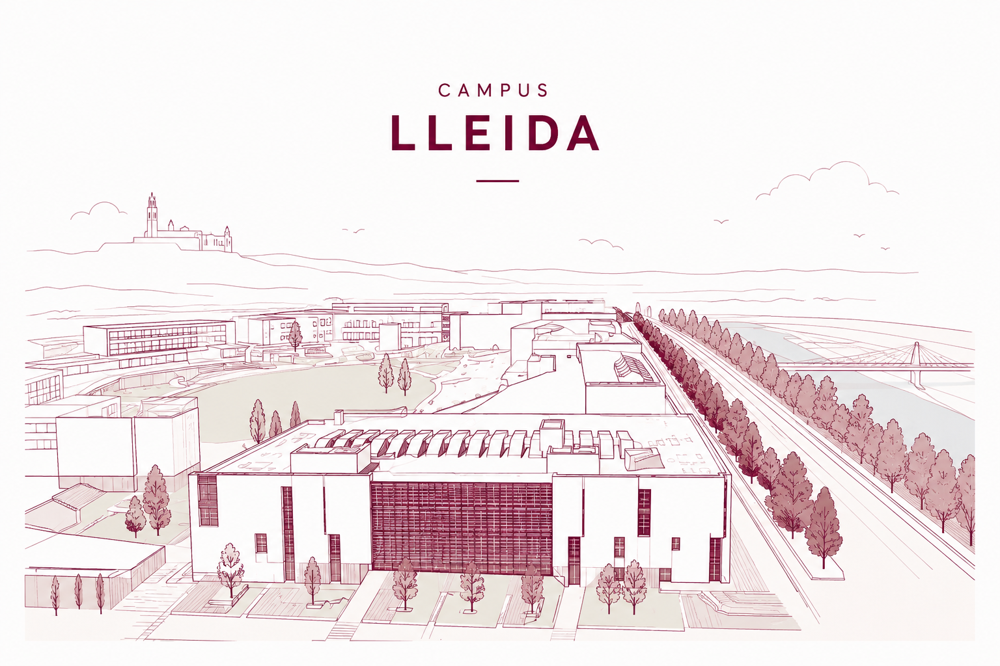
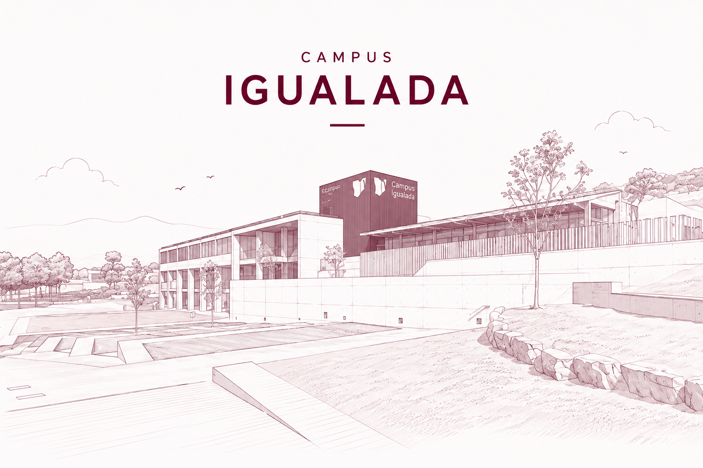
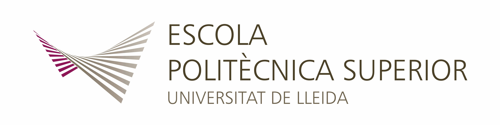

<main class="landing">

<header class="hero">

<h1>
Sistemes Operatius
</h1>

Curs sobre disseny i gestió de sistemes operatius basats en Unix, amb especial atenció als processos, mecanismes de comunicació, planificació de tasques i la gestió de memòria.

Curs 2026–2027 ·
Primer semestre ·
9 ECTS

</header>

<section class="campus-grid" aria-label="Campus">
<a class="campus-card" href="https://lleida.so.udl.cat/">

<h2>Campus Lleida</h2>

Grau en Enginyeria Informàtica

Accedir al curs

</a>
<a class="campus-card" href="https://igualada.so.udl.cat/">

<h2>Campus Igualada</h2>

Grau en Enginyeria Informàtica

Accedir al curs

</a>
</section>

<footer class="landing-footer">

</footer>

</main>
